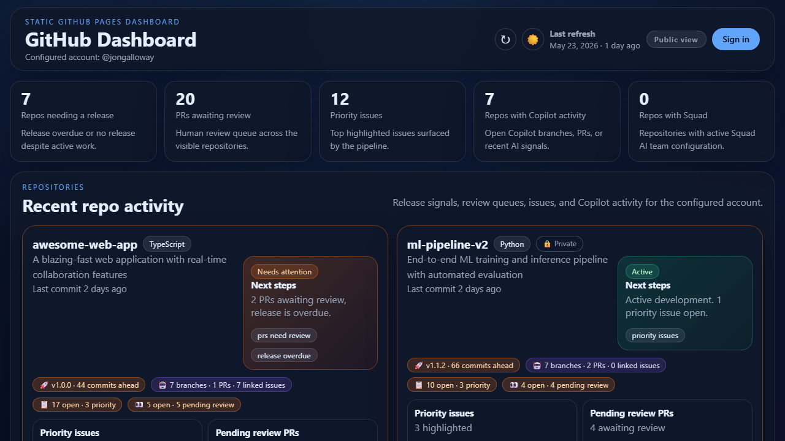

# GitHub Dashboard

A personal project dashboard that tracks status and next steps for your most recent GitHub repositories. Surfaces release readiness, Copilot activity, priority issues, and PR review queues.

**[Live Demo →](https://jongalloway.github.io/GitHubDashboard/)** *(original author's demo — fork and configure your own!)*



## Use It Yourself

This project is designed to be forked. All data is fetched directly in the browser using your GitHub Personal Access Token — no server-side pipeline or repository variables needed.

### Quick Setup

1. **Fork** this repository
2. Go to **Settings → Pages** and set Source to **GitHub Actions**
3. Go to **Actions → Deploy Dashboard** and click **Run workflow** (or push to main)
4. Your dashboard will be live at `https://{your-username}.github.io/GitHubDashboard/`
5. Visit the site and click **Sign in** to enter a Personal Access Token

That's it. The dashboard fetches your data client-side — nothing is stored on the server.

### PAT Scopes

The dashboard works with a basic read-only Personal Access Token. Here's what each feature requires:

- **Core features** (releases, PRs, issues, Copilot activity) — `repo` scope (or `public_repo` for public repos only)
- **Blocked lane (security alerts)** — add `security_events` scope to enable Dependabot alerts; also requires **admin access** for private repositories
- **Workflow status** — included with `repo` scope
- **Graceful degradation** — if a scope is missing, those signals simply stay empty in the dashboard (no errors)

If unsure, start with `repo` + `security_events` — your token stays secure in your browser.

### Local Development

```bash
# Serve locally (any static server works)
npx serve .
```

To test with live data locally, you can also run the data fetch script:

```bash
# Install dependencies
npm install

# Set your token and fetch data
export GITHUB_TOKEN=$(gh auth token)
export DASHBOARD_OWNER=your-username
npm run fetch-data

# Serve locally
npx serve .
```

The generated `data/dashboard.json` is gitignored and used only for local testing.

## How It Works

- The **GitHub Actions workflow** deploys the static app shell to GitHub Pages on every push to main
- When you open the dashboard, it checks for a stored Personal Access Token in your browser
- With a PAT, all data is fetched directly from the GitHub API in the browser
- No data files are stored in the repository or served from Pages
- GitHub Pages serves the static app; your token stays in your browser's localStorage

## Features

- 🚀 **Release readiness** — flags repos with 10+ commits since last release
- 🤖 **Copilot activity** — surfaces `copilot/*` branches and Copilot-authored PRs
- 📋 **Priority issues** — highlights unassigned/unlabeled issues needing triage
- 👀 **PR review queue** — shows PRs awaiting human review
- 🎯 **Next-step signals** — each repo card shows what needs attention and why

## Stack

- Vanilla HTML/CSS/JS (no build tools)
- Node.js for optional local data fetch (`scripts/fetch-data.js`)
- GitHub Actions for deployment
- GitHub Pages for hosting
